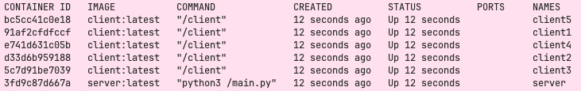

# TP0: Docker + Comunicaciones + Concurrencia

En el presente repositorio se provee un esqueleto básico de cliente/servidor, en donde todas las dependencias del mismo se encuentran encapsuladas en containers. Los alumnos deberán resolver una guía de ejercicios incrementales, teniendo en cuenta las condiciones de entrega descritas al final de este enunciado.

 El cliente (Golang) y el servidor (Python) fueron desarrollados en diferentes lenguajes simplemente para mostrar cómo dos lenguajes de programación pueden convivir en el mismo proyecto con la ayuda de containers, en este caso utilizando [Docker Compose](https://docs.docker.com/compose/).

## Instrucciones de uso
El repositorio cuenta con un **Makefile** que incluye distintos comandos en forma de targets. Los targets se ejecutan mediante la invocación de:  **make \<target\>**. Los target imprescindibles para iniciar y detener el sistema son **docker-compose-up** y **docker-compose-down**, siendo los restantes targets de utilidad para el proceso de depuración.

Los targets disponibles son:

| target  | accion  |
|---|---|
|  `docker-compose-up`  | Inicializa el ambiente de desarrollo. Construye las imágenes del cliente y el servidor, inicializa los recursos a utilizar (volúmenes, redes, etc) e inicia los propios containers. |
| `docker-compose-down`  | Ejecuta `docker-compose stop` para detener los containers asociados al compose y luego  `docker-compose down` para destruir todos los recursos asociados al proyecto que fueron inicializados. Se recomienda ejecutar este comando al finalizar cada ejecución para evitar que el disco de la máquina host se llene de versiones de desarrollo y recursos sin liberar. |
|  `docker-compose-logs` | Permite ver los logs actuales del proyecto. Acompañar con `grep` para lograr ver mensajes de una aplicación específica dentro del compose. |
| `docker-image`  | Construye las imágenes a ser utilizadas tanto en el servidor como en el cliente. Este target es utilizado por **docker-compose-up**, por lo cual se lo puede utilizar para probar nuevos cambios en las imágenes antes de arrancar el proyecto. |
| `build` | Compila la aplicación cliente para ejecución en el _host_ en lugar de en Docker. De este modo la compilación es mucho más veloz, pero requiere contar con todo el entorno de Golang y Python instalados en la máquina _host_. |

### Servidor

Se trata de un "echo server", en donde los mensajes recibidos por el cliente se responden inmediatamente y sin alterar. 

Se ejecutan en bucle las siguientes etapas:

1. Servidor acepta una nueva conexión.
2. Servidor recibe mensaje del cliente y procede a responder el mismo.
3. Servidor desconecta al cliente.
4. Servidor retorna al paso 1.


### Cliente
 se conecta reiteradas veces al servidor y envía mensajes de la siguiente forma:
 
1. Cliente se conecta al servidor.
2. Cliente genera mensaje incremental.
3. Cliente envía mensaje al servidor y espera mensaje de respuesta.
4. Servidor responde al mensaje.
5. Servidor desconecta al cliente.
6. Cliente verifica si aún debe enviar un mensaje y si es así, vuelve al paso 2.

### Ejemplo

Al ejecutar el comando `make docker-compose-up`  y luego  `make docker-compose-logs`, se observan los siguientes logs:

```
client1  | 2024-08-21 22:11:15 INFO     action: config | result: success | client_id: 1 | server_address: server:12345 | loop_amount: 5 | loop_period: 5s | log_level: DEBUG
client1  | 2024-08-21 22:11:15 INFO     action: receive_message | result: success | client_id: 1 | msg: [CLIENT 1] Message N°1
server   | 2024-08-21 22:11:14 DEBUG    action: config | result: success | port: 12345 | listen_backlog: 5 | logging_level: DEBUG
server   | 2024-08-21 22:11:14 INFO     action: accept_connections | result: in_progress
server   | 2024-08-21 22:11:15 INFO     action: accept_connections | result: success | ip: 172.25.125.3
server   | 2024-08-21 22:11:15 INFO     action: receive_message | result: success | ip: 172.25.125.3 | msg: [CLIENT 1] Message N°1
server   | 2024-08-21 22:11:15 INFO     action: accept_connections | result: in_progress
server   | 2024-08-21 22:11:20 INFO     action: accept_connections | result: success | ip: 172.25.125.3
server   | 2024-08-21 22:11:20 INFO     action: receive_message | result: success | ip: 172.25.125.3 | msg: [CLIENT 1] Message N°2
server   | 2024-08-21 22:11:20 INFO     action: accept_connections | result: in_progress
client1  | 2024-08-21 22:11:20 INFO     action: receive_message | result: success | client_id: 1 | msg: [CLIENT 1] Message N°2
server   | 2024-08-21 22:11:25 INFO     action: accept_connections | result: success | ip: 172.25.125.3
server   | 2024-08-21 22:11:25 INFO     action: receive_message | result: success | ip: 172.25.125.3 | msg: [CLIENT 1] Message N°3
client1  | 2024-08-21 22:11:25 INFO     action: receive_message | result: success | client_id: 1 | msg: [CLIENT 1] Message N°3
server   | 2024-08-21 22:11:25 INFO     action: accept_connections | result: in_progress
server   | 2024-08-21 22:11:30 INFO     action: accept_connections | result: success | ip: 172.25.125.3
server   | 2024-08-21 22:11:30 INFO     action: receive_message | result: success | ip: 172.25.125.3 | msg: [CLIENT 1] Message N°4
server   | 2024-08-21 22:11:30 INFO     action: accept_connections | result: in_progress
client1  | 2024-08-21 22:11:30 INFO     action: receive_message | result: success | client_id: 1 | msg: [CLIENT 1] Message N°4
server   | 2024-08-21 22:11:35 INFO     action: accept_connections | result: success | ip: 172.25.125.3
server   | 2024-08-21 22:11:35 INFO     action: receive_message | result: success | ip: 172.25.125.3 | msg: [CLIENT 1] Message N°5
client1  | 2024-08-21 22:11:35 INFO     action: receive_message | result: success | client_id: 1 | msg: [CLIENT 1] Message N°5
server   | 2024-08-21 22:11:35 INFO     action: accept_connections | result: in_progress
client1  | 2024-08-21 22:11:40 INFO     action: loop_finished | result: success | client_id: 1
client1 exited with code 0
```


## Parte 1: Introducción a Docker
En esta primera parte del trabajo práctico se plantean una serie de ejercicios que sirven para introducir las herramientas básicas de Docker que se utilizarán a lo largo de la materia. El entendimiento de las mismas será crucial para el desarrollo de los próximos TPs.

### Ejercicio N°1:
Definir un script de bash `generar-compose.sh` que permita crear una definición de Docker Compose con una cantidad configurable de clientes.  El nombre de los containers deberá seguir el formato propuesto: client1, client2, client3, etc. 

El script deberá ubicarse en la raíz del proyecto y recibirá por parámetro el nombre del archivo de salida y la cantidad de clientes esperados:

`./generar-compose.sh docker-compose-dev.yaml 5`

Considerar que en el contenido del script pueden invocar un subscript de Go o Python:

```
#!/bin/bash
echo "Nombre del archivo de salida: $1"
echo "Cantidad de clientes: $2"
python3 mi-generador.py $1 $2
```

En el archivo de Docker Compose de salida se pueden definir volúmenes, variables de entorno y redes con libertad, pero recordar actualizar este script cuando se modifiquen tales definiciones en los sucesivos ejercicios.

### Ejercicio N°2:
Modificar el cliente y el servidor para lograr que realizar cambios en el archivo de configuración no requiera reconstruír las imágenes de Docker para que los mismos sean efectivos. La configuración a través del archivo correspondiente (`config.ini` y `config.yaml`, dependiendo de la aplicación) debe ser inyectada en el container y persistida por fuera de la imagen (hint: `docker volumes`).


### Ejercicio N°3:
Crear un script de bash `validar-echo-server.sh` que permita verificar el correcto funcionamiento del servidor utilizando el comando `netcat` para interactuar con el mismo. Dado que el servidor es un echo server, se debe enviar un mensaje al servidor y esperar recibir el mismo mensaje enviado.

En caso de que la validación sea exitosa imprimir: `action: test_echo_server | result: success`, de lo contrario imprimir:`action: test_echo_server | result: fail`.

El script deberá ubicarse en la raíz del proyecto. Netcat no debe ser instalado en la máquina _host_ y no se pueden exponer puertos del servidor para realizar la comunicación (hint: `docker network`). `


### Ejercicio N°4:
Modificar servidor y cliente para que ambos sistemas terminen de forma _graceful_ al recibir la signal SIGTERM. Terminar la aplicación de forma _graceful_ implica que todos los _file descriptors_ (entre los que se encuentran archivos, sockets, threads y procesos) deben cerrarse correctamente antes que el thread de la aplicación principal muera. Loguear mensajes en el cierre de cada recurso (hint: Verificar que hace el flag `-t` utilizado en el comando `docker compose down`).

## Parte 2: Repaso de Comunicaciones

Las secciones de repaso del trabajo práctico plantean un caso de uso denominado **Lotería Nacional**. Para la resolución de las mismas deberá utilizarse como base el código fuente provisto en la primera parte, con las modificaciones agregadas en el ejercicio 4.

### Ejercicio N°5:
Modificar la lógica de negocio tanto de los clientes como del servidor para nuestro nuevo caso de uso.

#### Cliente
Emulará a una _agencia de quiniela_ que participa del proyecto. Existen 5 agencias. Deberán recibir como variables de entorno los campos que representan la apuesta de una persona: nombre, apellido, DNI, nacimiento, numero apostado (en adelante 'número'). Ej.: `NOMBRE=Santiago Lionel`, `APELLIDO=Lorca`, `DOCUMENTO=30904465`, `NACIMIENTO=1999-03-17` y `NUMERO=7574` respectivamente.

Los campos deben enviarse al servidor para dejar registro de la apuesta. Al recibir la confirmación del servidor se debe imprimir por log: `action: apuesta_enviada | result: success | dni: ${DNI} | numero: ${NUMERO}`.


#### Servidor
Emulará a la _central de Lotería Nacional_. Deberá recibir los campos de la cada apuesta desde los clientes y almacenar la información mediante la función `store_bet(...)` para control futuro de ganadores. La función `store_bet(...)` es provista por la cátedra y no podrá ser modificada por el alumno.
Al persistir se debe imprimir por log: `action: apuesta_almacenada | result: success | dni: ${DNI} | numero: ${NUMERO}`.

#### Comunicación:
Se deberá implementar un módulo de comunicación entre el cliente y el servidor donde se maneje el envío y la recepción de los paquetes, el cual se espera que contemple:
* Definición de un protocolo para el envío de los mensajes.
* Serialización de los datos.
* Correcta separación de responsabilidades entre modelo de dominio y capa de comunicación.
* Correcto empleo de sockets, incluyendo manejo de errores y evitando los fenómenos conocidos como [_short read y short write_](https://cs61.seas.harvard.edu/site/2018/FileDescriptors/).


### Ejercicio N°6:
Modificar los clientes para que envíen varias apuestas a la vez (modalidad conocida como procesamiento por _chunks_ o _batchs_). 
Los _batchs_ permiten que el cliente registre varias apuestas en una misma consulta, acortando tiempos de transmisión y procesamiento.

La información de cada agencia será simulada por la ingesta de su archivo numerado correspondiente, provisto por la cátedra dentro de `.data/datasets.zip`.
Los archivos deberán ser inyectados en los containers correspondientes y persistido por fuera de la imagen (hint: `docker volumes`), manteniendo la convencion de que el cliente N utilizara el archivo de apuestas `.data/agency-{N}.csv` .

En el servidor, si todas las apuestas del *batch* fueron procesadas correctamente, imprimir por log: `action: apuesta_recibida | result: success | cantidad: ${CANTIDAD_DE_APUESTAS}`. En caso de detectar un error con alguna de las apuestas, debe responder con un código de error a elección e imprimir: `action: apuesta_recibida | result: fail | cantidad: ${CANTIDAD_DE_APUESTAS}`.

La cantidad máxima de apuestas dentro de cada _batch_ debe ser configurable desde config.yaml. Respetar la clave `batch: maxAmount`, pero modificar el valor por defecto de modo tal que los paquetes no excedan los 8kB. 

Por su parte, el servidor deberá responder con éxito solamente si todas las apuestas del _batch_ fueron procesadas correctamente.

### Ejercicio N°7:

Modificar los clientes para que notifiquen al servidor al finalizar con el envío de todas las apuestas y así proceder con el sorteo.
Inmediatamente después de la notificacion, los clientes consultarán la lista de ganadores del sorteo correspondientes a su agencia.
Una vez el cliente obtenga los resultados, deberá imprimir por log: `action: consulta_ganadores | result: success | cant_ganadores: ${CANT}`.

El servidor deberá esperar la notificación de las 5 agencias para considerar que se realizó el sorteo e imprimir por log: `action: sorteo | result: success`.
Luego de este evento, podrá verificar cada apuesta con las funciones `load_bets(...)` y `has_won(...)` y retornar los DNI de los ganadores de la agencia en cuestión. Antes del sorteo no se podrán responder consultas por la lista de ganadores con información parcial.

Las funciones `load_bets(...)` y `has_won(...)` son provistas por la cátedra y no podrán ser modificadas por el alumno.

No es correcto realizar un broadcast de todos los ganadores hacia todas las agencias, se espera que se informen los DNIs ganadores que correspondan a cada una de ellas.

## Parte 3: Repaso de Concurrencia
En este ejercicio es importante considerar los mecanismos de sincronización a utilizar para el correcto funcionamiento de la persistencia.

### Ejercicio N°8:

Modificar el servidor para que permita aceptar conexiones y procesar mensajes en paralelo. En caso de que el alumno implemente el servidor en Python utilizando _multithreading_,  deberán tenerse en cuenta las [limitaciones propias del lenguaje](https://wiki.python.org/moin/GlobalInterpreterLock).

## Condiciones de Entrega
Se espera que los alumnos realicen un _fork_ del presente repositorio para el desarrollo de los ejercicios y que aprovechen el esqueleto provisto tanto (o tan poco) como consideren necesario.

Cada ejercicio deberá resolverse en una rama independiente con nombres siguiendo el formato `ej${Nro de ejercicio}`. Se permite agregar commits en cualquier órden, así como crear una rama a partir de otra, pero al momento de la entrega deberán existir 8 ramas llamadas: ej1, ej2, ..., ej7, ej8.
 (hint: verificar listado de ramas y últimos commits con `git ls-remote`)

Se espera que se redacte una sección del README en donde se indique cómo ejecutar cada ejercicio y se detallen los aspectos más importantes de la solución provista, como ser el protocolo de comunicación implementado (Parte 2) y los mecanismos de sincronización utilizados (Parte 3).

Se proveen [pruebas automáticas](https://github.com/7574-sistemas-distribuidos/tp0-tests) de caja negra. Se exige que la resolución de los ejercicios pase tales pruebas, o en su defecto que las discrepancias sean justificadas y discutidas con los docentes antes del día de la entrega. 

El incumplimiento de las pruebas es condición de desaprobación, pero su cumplimiento no es suficiente para la aprobación.  Se pide a los alumnos leer atentamente y **tener en cuenta** los criterios de corrección informados  [en el campus](https://campusgrado.fi.uba.ar/mod/page/view.php?id=73393).
Respetar el formato y contenido las entradas de logs descritas en los ejercicios, pues son las que se chequean en cada uno de los tests.

## Implementación del alumno

### General

A lo largo del desarrollo del TP se generan algunos archivos `.sh`. Los mismos por lo general van a requerir que se les otorgue permiso de ejecución. Para ello se debe ejecutar para c/u:

```bash
chmod +x <ARCHIVO.sh>
```

### Ej 1

#### Como ejecutar

```bash
./generar-compose.sh <OUTPUT> <NUM_CLIENTS>
```

**OUTPUT:** Nombre del yaml resultante
**OUTPUT:** Cantidad de clientes que se van a generar

Luego de correr el script satisfactoriametne se obtiene el archivo **OUTPUT** como resultado. Se recomienda la ejecución con **OUTPUT=docker-compose-dev.yaml** para poder ejecutar los comandos del makefile.

```bash
./generar-compose.sh docker-compose-dev.yaml 5
```


Podemos levantar los contenedores
```bash
make docker-compose-up
```

Validar que se hayan levantado los contenedores deseados (1 server + los **NUM_CLIENTS** clientes)
```bash
docker ps -a
```



Validamos la creación de la network de docker
```bash 
docker network ls
```

#### Implementación

Se generó el script solicitado, el cual dentro ejecuta un script de go.

Este script de go toma como base una plantilla del yaml al que queremos llegar, pero sin los clientes definidos: `/script-compose/docker-compose-base.yaml`.

Se hace uso del pkg `gopkg.in/yaml.v2`.


### Ej 2

#### Como ejecutar

Se ejecuta de la misma forma que el ej 1.

```bash
./generar-compose.sh docker-compose-dev.yaml 5
make docker-compose-up
```

Para validar el funcionamiento, se pueden modificar los archivos `server/config.ini` y/o `client/config.yaml` **sin reconstruir las imágenes**, ya que estos archivos se montan como volúmenes en los contenedores.

Por ejemplo:
- Cambiar `log.level` en `client/config.yaml` de `INFO` a `DEBUG` para ver mensajes más detallados en los logs del cliente.
- Cambiar `batch.maxAmount` en `client/config.yaml` para modificar la cantidad de mensajes enviados por lote.
- Cambiar `LOGGING_LEVEL` en `server/config.ini` para controlar la verbosidad del servidor.

Luego de modificar cualquiera de estos valores, basta con reiniciar los contenedores para que los cambios tomen efecto:

```bash
make docker-compose-down
make docker-compose-up
```

#### Implementación

Se agregaron volúmenes en el compose generado para montar los archivos de configuración directamente desde el host:

- `./client/config.yaml:/config.yaml` para cada cliente
- `./server/config.ini:/config.ini` para el servidor

Esto permite modificar la configuración en tiempo de desarrollo sin necesidad de regenerar las imágenes con `make docker-image`.

También se eliminaron las env-var asociadas a las configs, tales como el log_level.


### Ej 3

#### Como ejecutar


```bash
./validar-echo-server.sh
```

La idea es probarlo con el server levantado y caido

Para ello, con el `.yaml` del compose ya generado:

```bash
make docker-compose-up
./validar-echo-server.sh
```

Dado que se acaba de levantar el server, deberíamos recibir un `success`

Ahora vamos a bajar el server y volver a probar

```bash
docker stop server
./validar-echo-server.sh
```

Con el server detenido, ahora deberíamos recibir un `fail`

#### Implementación

Dado que se pide no instalar netcat en la máquina host, se realiza el request desde un contenedor efímero (el --rm del argumento)

Se usa la imágen `busybox` ya que es la más ligera (incluso que alpine) que cuenta con netcat para cumplir la finalidad


### Ej 4

#### Como ejecutar

Con el server y/o clientes corriendo

```bash
docker ps -q -f "name=<service>" | xargs docker stop    
```

**<service>:** Reemplazar con `server` o `client1`, `client2`, etc.

Luego revisar logs


```bash
docker logs <service>    
```

Se encuentran logs indicando la identificación del sigterm y la liberación de recursos. Por ej:

> 2026-03-25 02:43:00 INFO     action: sigterm_received | result: success
> 
> 2026-03-25 02:43:00 INFO     action: close_server_socket | result: success

#### Implementación

En el loop del cliente se está escuchando un channel con el sigterm bindeado, esperando a recibir la notificación para abandonar el loop y con eso finalizar liberando los recursos.
Al emplear este enfoque, modificamos el uso de `sleep` por un `ticker` que cumple la misma función de simular una espera, pero permitiendo la utilización del select para chequear el canal.

```go
sigChan := make(chan os.Signal, 1)
signal.Notify(sigChan, syscall.SIGTERM)
defer signal.Stop(sigChan)
...
for {
    ...
    select {
		case <-sigChan:
			log.Infof("action: sigterm_received | result: success | client_id: %v", c.config.ID)
            	return
		case <-ticker.C:
    ...
}
```

Por otro lado, en el server se define un handler de sigterm. El mismo cambia el estado del server a `running = false` y cierra el socket. Este cambio al estado sirve para identificar si una falla en la lectura del socket se da por un cierre planeado o no.

```python
def __handle_sigterm(self, *args):
    logging.info("action: sigterm_received | result: success")
    self._running = False
    self._server_socket.close()
    logging.info("action: close_server_socket | result: success")
```


### Ej 5

#### Como ejecutar

Generar el compose con el script y ejecutar con el make como se venía haciendo previamente.

#### Implementación

Lo primero y menos relevante. Para el script generador se armó un listado `clients.yaml` con el único fin de poder hacer dinámica la generación de clientes para este ejercicio. Esto incluye leer los clientes según el parámetro con el que se ejecuta el script y cargar sus datos como env-vars. En los siguientes puntos esto se remueve.

Se definen capas bien separadas. Una es el protocolo, que define la comuniación. Por otro lado una propia del dominio, las bets/apuestas.


El protocolo en este punto se define como mensajes de servidor por un lado y de cliente por el otro.
Este comentario en `protocol.py` lo detalla bien

```python
#   Request  (client → server): [2 bytes uint16 BE: payload length][payload: UTF-8 CSV string]
#   Response (server → client): [1 byte: 0x00=OK, 0x01=ERROR]
```

El cliente al hacer un request utiliza 2 bytes como header (big endian, como define el estándar de TCP) para indicar el tamaño del payload que acompaña al mensaje. El objetivo es que el server lea 2 bytes "fijos" y que a partir de estos pueda leer los N bytes "variables" que le siguen.

El server por su parte, solamente responde un byte que puede significar un OK o un Error.


Se hace uso de las configs del cliente:
```yaml
loop:
  amount: 5
  period: "5s"
```
Se utilizan para definir los reintentos al establecer la conexión inicial con el server.


### Ej 6

#### Como ejecutar

Generar el compose con el script y ejecutar con el make como se venía haciendo previamente tras descomprimir los datasets zipeados.

```bash
unzip .data/dataset.zip -d .data/
```

#### Implementación

Se elimina toda la lógica de la apuesta por cliente. En su lugar se pasan a leer los datasets correspondientes a c/u. Esto implica añadir un volúmen que monte el dataset propio de cada cliente en el mismo.

Se implementa la lógica de los batches manteniendo la abstracción del lado del protocolo. (Se envían batches pero no se define de qué).
Estos batches son las tiras de bytes, pero separadas por saltos de linea (tambien en bytes).
El protocolo por el resto se mantiene igual.

El cliente tiene 2 límites a la hora de armar los batches:
1. **Límite de amount por config:** Delimita la cantidad máxima de bets que pueden incluirse en un batch independientemente de su tamaño. Es configurable en su `config.yaml`
2. **Límite de KB's:** Delimia el máximo de bytes que se incluyen en un batch. Puede haber bets sumamente largas que sumadas no lleguen a alcanzar el número máx configurado, pero que sumando su peso excedan el umbral. No es configurable.

La existencia de estos batches permite reducir la cantidad de mensajes enviados por red (y por ende reducir el overhead de los headers). Al realizarse la lectura del dataset on-demand (no cargar todo en memoria), si se detecta que la última bet leida causaría un exceso del máx en KB's de un batch, la misma se guarda en memoria y se reserva para la siguiente iteración.


### Ej 7

#### Como ejecutar

Se ejecuta de igual forma que el ej 6.

#### Implementación

Por error mío implementé primero el punto 8 y luego me dí cuenta de que me había faltado el 7, por lo que siento un poco antinatural la implementación. Para no "adelantarme" al 8, me centré en hacer que todo el manejo de conexiones de este punto sea monohilo.

El server solo va a escuchar conexiones hasta que N clientes/agencies se hayan conectado correctamente y realizado sus bets. Este valor N es configurable mediante la env-var del server `SERVER_NUMBER_OF_AGENCIES`.

La idea para mantener el mono-hilo es la siguiente:
* Aceptar de a una conexión por vez
* Recibir los batches hasta el mensaje de fin de batch
* Mantener abierta la conexión y acumular el scoket en `waiting_sockets`
* El cliente envía el mensaje de query de winners, pero el server aún no va a escucharlo.
* Sin cerrar dicha conexión, aceptar una nueva y repetir

Este ciclo se corta con el sigterm o al haber alcanzado los N clientes esperados. Desde ese punto se cierra el socket que acepta conexiones.

Una vez recibidos los N clientes con sus bets se procede al sorteo.
Tras el sorteo, se iteran los `waiting_sockets` para en cada uno escuchar el mensaje de query y dar la respuesta, teniendo un finally que cierra el socket independientemente de si hay o no error.

En cuanto al cliente, ví dos caminos posibles (esto se repite en el punto 8) en cuanto a la query de los winners:
1. El que tomé. El cliente envía el DONE y automáticamente envía la query, quedandose bloqueado esperando a la respuesta. Esto implica esperar a que se procesen todos los demás clientes hasta alcanzar N + que se le responda la query a todos los clientes previos.
2. La opción que no tomé. Una especie de bussy wait / poll por parte del cliente. En lugar de utilizar la misma conexión, una vez que el cliente envía el DONE podría cerrar el socket y automáticamente abrir una nueva conexión que haga el query. El server al detectar que aún no se realizó el sorteo debería responder a estas conexiones rechazando la query. El objetivo es no tener lockeado al cliente y que el server no deba persistir las conexiones en espera.

Además, por el proceso secuencial de clientes, aunque los N clientes intentan conectarse a la vez van a ser aceptados de a uno.